## Computer Performance

#### Instruction Set Architecture

-   Defines the set of instructions that a computer/processor can execute
-   The contract between the hardware and software
-   examples:
    -   x86
    -   ARM
    -   MIPS


#### 1. Timing Performance


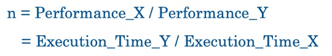


#### 2. CPU Clocking

-   one clock cycle: the unit of the CPU clock
-   clock period: time per clock cycle
-   clock frequency (clock rate): clock cycle per second

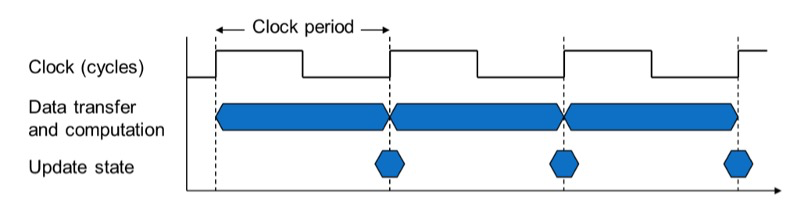


#### 3. CPU Time

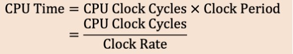


#### 4. Clock cycles per instructions (CPI)

the average number of clock cycles each instruction takes to execute


-   CPI is determined by how you design the CPU

-   Instruction Count is determined by program, ISA and compiler

    

#### 5. The Classic CPU Performance Equation

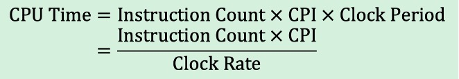


#### 6. Average CPI (weighted average)

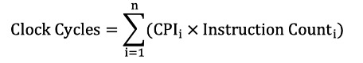

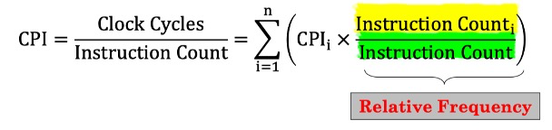

-   IC~i~ is weighted SUM of instructions
-   IC is just the SUM of instructions


#### 7. Power and Energy

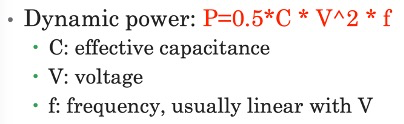
## Computer Arithmetic

#### 1. Scientific Notation

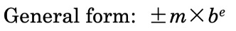

-   m: significand
-   b: base number
-   exponent e: an integer


#### 2. Normalized scientific notation

1 <= |m| < 10


#### 3. Normalized scientific notatoin in binary

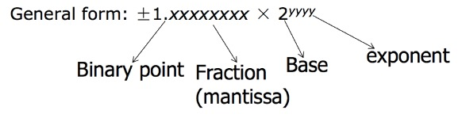

==We'll always have a '1' to the left of the binary point==


#### 4. The IEEE Standard for Floating-Point Arithmetic (IEEE 754)

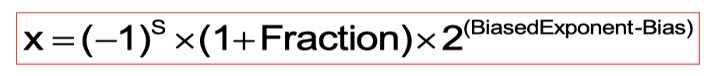

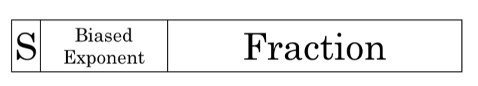

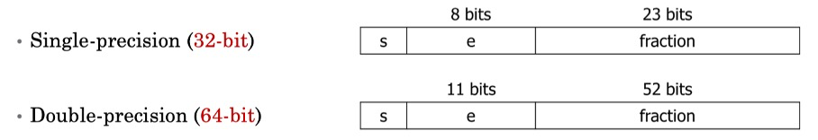

-   a technical standard for floating-point computation
-   a type of sign adn magnitude representation
-   s: sign bit of the fraction
-   <u>biased exponen</u>t: actual exponent + bias
-   <u>bias of single precision</u>: 127
-   <u>bias of double precision</u>: 1023


#### 5. Special Values (Single Precision)

-   Smallest postive normalized number: 1.0~2~ * 2^-126^

-   Least negative normalized number: -1.0~2~ * 2^-126^

-   Zero: 1.0~2~ * 2^-127^ or -1.0~2~ * 2^-127^

-   Largest positive normalized number:

    1.1111 1111 1111 1111 1111 111~2~ * 2^127^

-   Most negative normalized number:

    -1.1111 1111 1111 1111 1111 111~2~ * 2^127^

-   Infinitude: 1.0 * 2^128^ or -1.0 * 2^128^

-   NaN: 1.f * 2^128^ where f != 0


#### 6. NaN (Not-a-Number)

a numeric data type value representing an undefined value

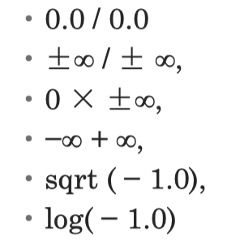

#### 7. Equality Conditions

-   In most computers: $0.3 + 0.2 \neq 0.5$

    -   Neither 0.3 nor 0.2 has exact binary representation

-   Never directly test floating point numbers for equality

    -   Using the following statement instead

        $|0.3 + 0.2 - 0.5| < \varepsilon$


## MIPS Programming 1

### MIPS Instruction Basics

##### 1. Bit, Byte and Word

-   Bit: binary digit, either 0 or 1
-   Byte: a byte has 8 bits in length
-   Word: a word is 4 bytes long on the 32-bit MIPS


##### 2. Program Counter (PC)

-   points to the memory location of the current instruction
-   fetches instructions from where PC points
-   change for the next instruction


##### 3. MIPS (Microprocessor without Interlocked Processor States)

-   Instruction Set Architecture based on Reduced Instruction Set Computing **(RISC)** CPU design strategy
-   Make instructions simple but execute them fast
-   In contrast with Complex Instruction Set Computing (CISC) e.g., Intel x86 architecture


##### 4. MIPS Basic Syntax

-   <u>Assemble directives</u> begin with a dot '.'
    -   .data: start assembling data used by the program
    -   .text.: start assembling program instructions
    -   .asciiz: place a null-terminated **ASCII string** in the memory
-   <u>Labels</u> are names followed by a colon ':'
    -   Descriptive names chosen by programmers
    -   The assembler will assign memory address to labels for later reference
    -   The label "main" is the entry of the program
-   Lines after "main": contain symbolic machine instructions

```assembly
.data
    num:   .word 42       # 定义一个32位整数，初始值为42
    array: .byte 1, 2, 3  # 定义一个字节数组，初始值为1, 2, 3
    str:   .asciiz "Hello" # 定义一个以空字符结尾的字符串
```


### MIPS Operands

##### 5. General syntax

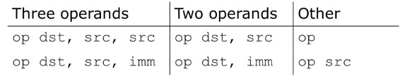

-   dst: destination register
-   src: source register
-   imm: immediate value **(16 bits)**

MIPS Instruction Format是 MIPS 架构中指令的编码方式，所有 MIPS 指令都是 32 位长，分为三种基本格式：R 型（寄存器型）、I 型（立即数型）和 J 型（跳转型）。

##### 6. MIPS Arithmetic

-   add

`add $s0, $s1, $s2		# s0 = s1 + s2`

-   subtract

`sub rd, rs1, rs2		# rd = rs1 - rs2 `

If it does not set the register, the default value of the register is 0.

##### 7. MIPS Registers

-   assembly don't use variables => (most) assembly operands are registers
    -   Limited number of special hardware built directly inside the CPU
    -   Operations are **performed on them directly**
-   Benefits
    -   Registers in CPU: faster than memory
    -   Registers are easier for compiler to use
    -   Register can hold variables to reduce memory traffic


-   32 registers, each is 32 bits wide
    -   Group of 32 bits called a word in MIPS
    -   Registers are numbered from 0 to 31
    -   Each can be referred to by number or name


##### 8. Memory Operands

-   Memory contains large data structures like arrays
-   But MIPS arithmetic instructions operate on registers, not directly on memory
    -   data transfer instructions (lw, sw, lb, sb) to transfer between memory and register
-   ==Only load and store instructions can access memory==

##### 9 Data Transfer

```assembly
lw $t0, 12($s0)		// lw: load word	Memory to Register
sw $t0, 12($s0)		// sw: store word	Register to Memory
```

-   `$s0` is called the **base register** storing the address in memory, 12 is called the **offset**
-   `lw` (a word 32 bits= 4*8 is loaded at a time) 
-   Offset is generally used in accessing elements of array
-   Base register points to the beginning of the array


##### 10. Memory Addressing

-   MIPS memory is byte-addressable (not word addressable)
-   Each byte has a unique address
-   Load and store single bytes: load byte (lb) and store byte (sb) 
-   Each 32-bit words has 4 bytes, so the word address increments by 4


-   Little-Endian: orders bytes starting at the least significant end
-   Big-Endian: order bytes starting at the most significant end


##### 11. Role of Registers vs. Memory

-   What if there are more variables than registers in your code?
    -   Compiler tries to keep most frequently used variables in registers
    -   Put less common variables into memory: spilling
-   Why not keep all variables in memory?
    -   **Design Principle**: Smaller is faster
    -   Registers are more versatile


##### 12. Immediate Operands

-   Add Immediate:

    ```assembly
    addi $s0, $s1, 10		// s0 = s1 + 10
    addi $s2, $s1, -1		// use addition to perform subtraction
    ```

-   The Constant zero
    -   ==We define register zero to be constant 0==
    -   $zero cannot be overwritten
    -   useless instruction: `addi $0, $0, 5`


### Other MIPS Operations

##### 13. Bitwise operations

- Shift Instructions

  -   `sll` (shift left logical): shifts left, fills empty with 0

  -   `srl` (shift right logical): shifts right, fills empty with 0

  -   `sra` (shift right arithmetic): shifts right, fills empty with **sign extending**

      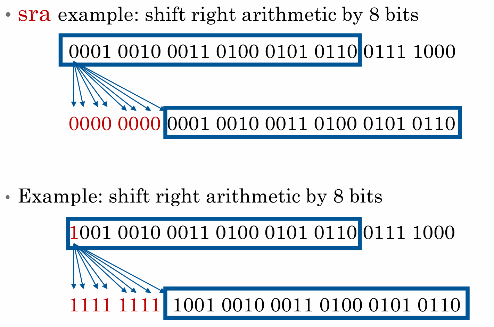

  -   **Application**: <u>Multiplying by $2^n$</u> is the same as shifting left by n `sll $s0,$s0,n`

  -   Application: Divide by $2^n$ is `sra $s0,$s0,n`

- Logical operators

  - `NOT(A) = NOR(A, zero)`. No `not` in MIPS.

  -   `nor $t0, $t1, $zero`

  - **==There is no `nori` operation==** 

  - `and $t0, $t1, $t2`

    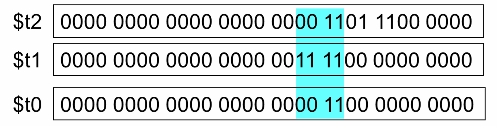


##### 14. Floating-Point-Architecture

-   IEEE operations performed by **Floating Point Unit** (FPU)
    -   MIPS core refers to FPU as coprocessor 1
-   FPU features **32 single precision (32-bit)** registers
    -   `$f0, $f1, $f2, . . . , $f31`
-   Or as 16 pairs of **double precision (64 -bit)** registers
    -   `$f0, $f2, $f4, . . . , $f30 (even registers only!)`
    -   Here `$fi` actually stands for the pair `$fi` and `$f(i+1)`
-   ==`$f0` is NOT hardwired to the value 0.0!==


-   Addition:

    ```assembly
    add.s $f0, $f1, $f2		// single precision
    add.d $f0, $f2, $f4		// double precision
    ```

-   Load/Store

    ```assembly
    lwc1 fd, n(rs)			// load word coprocessor 1
    swc1 fd, n(rs) 			// store word coprocessor 1
    ```

-   Copying Data

    -   **only copy the bit pattern, not the actual value it represents**

    ```assembly
    mfc1 $t0, $f7 			// copy content of $f7 to $t0
    mtc1 $zero, $f12 		// set $f12 := 0
    ```


##### 15. Multiplication Instructions

-   MIPS stores the 64 bit result of the multiplication of two 32 bit registers in

    -   Bits 32 to 63 are stored in **Hi**
    -   Bits 0 to 31 are stored in **Lo**

-   There are two instructions: 

    -   multiply (`mult`) and unsigned multiply (`multu`)

    

##### 16. Division Instructions

-   MIPS stores the result of the division of two 32 bit registers in
    -   remainder is stored in **Hi**
    -   quotient is stored in **Lo**
-   There are two instructions: 
    -   divide (`div`) and unsigned divide (`divu`)


## MIPS Programming 2

### MIPS Decision Making and Branching

##### 1. Branching and Control flow

-   Branch instruction affects the Program Counter and hence control the flow of the program
-   **Conditional branch** instructions
-   **Unconditional branch** instructions


##### 2. Branch Instructions

-   `beq a, b, L		# branch on equal`
    -   go to label L if a == b
-   `bne a, b, L		# branch on not equal`
    -   go to label L if a != b
-   `j L		        # unconditional jump`
    -   unconditional jump to label L
-   `jr $s0          # jump regiter`
    -   jump into the location stored in the register
    -   It is identical to the pointer.


##### 3. Inequality in MIPS

-   set on Less Than
    -   `slt rd, rs, rt		   # if (rs < rt) then rd = 1; else rd = 0;`
    -   `slti rt, rs, constant      # if (rs < constant) then rt = 1; else rt = 0`


##### 4. Signed vs. Unsigned 'slt'

-   Signed comparison: `slt, slti`
-   Unsigned comparison: `sltu, sltui`


### MIPS Arrays

##### 5. Another way to load the array head

-   Give the base address: 0x12348000	(address of the first array element)

-   Use **lui + ori** to load 32-bit base address into a register

-   **lui** (load upper immediate)

    -   `lui $s0, 0x1234			# $s0 = 0x12340000`

-   **ori** (or immediate)

    -   `ori $s0, $s0, 0x8000 	# $s0 = 0x12348000`

-   Difference

    -   If the constant would fit 16 bits, use `li`

    -   If the constant needs `(16,32]` bits, use `lui + ori`

```assembly
# retrieve arr[6]into the $t4
la  $t3, arr 		# put address of arr into $t3
li  $t2, 6 			# put the index into $t2
sll $t2, $t2, 2   	# 4x the index to find the byte location 
add $t1, $t2, $t3 	# obtain the address, so t1 = 6 * 4 = 24

# two methods of changing the pointer
lw $t4, 0($t1) 	# suitable for loop, so it only maintains $t1
lw $t4, 24($t3) # suitable for accessing address only once
```

```assembly
lui $s0, 0x1234 	 # put 0x1234,0000 in upper half of $S0
ori $s0, $s0, 0x8000 # put 0x8000,0000 in lower half of $s0
lw $t1, 0($s0)       # $t1 = array[0]
sll $t1, $t1, 1      # $t1 = $t1 * 2
sw $t1, 0($s0)       # array[0] = $t1
```

### MIPS Procedures

##### 6. Procedures

-   Procedures are portion of code, within a larger program, which runs frequently
-   It helps to
    -   reduce code duplication
    -   improve code re-usability
    -   decompose complex programs into manageable parts
-   Other names
    -   Methods - java and other OO languages
    -   Functions - C, C++, Haskell
    -   Routines, subroutines

##### 7. Procedure Calling Conventions

-   Caller:
    -   passes arguments to callee
-   Callee:
    -   **must not overwrite** registers or memory needed by the caller
    -   returns to the point of call
    -   returns the result to caller

-   MIPS conventions
    -   Call procedure: jump and link `(jal)`
    -   Return from procedure: jump register `(jr)`
    -   Argument value: `$a0 - $a3`
    -   Return value: `$v0, ($v1 for 64-bit double)`

-   One example:
    -   `jal`: jumps to `simple` and saves PC+4 to the return the **defined address register** `($ra)`
    -   `jr $ra`: jumps to address in `$ra`, in this case, `$ra = 0x00400204` the next instruction.


##### 8. Another example

-   C Programming Code

    ```c
    int main()
    {
        int y;
        y = diffofsums(2,3,4,5);	// 4 arguments
       	...
    }
    int diffofsums(int f, int g, int h, int i)
    {
        int result;
        result = (f+g) - (h+i);
        return result;
    }
    ```

-   MIPS assembly code

    ```assembly
    main:
    	addi $a0, $0, 2		# a0 = 2
    	addi $a1, $0, 3		# a1 = 3
    	addi $a2, $0, 4		# a2 = 4
    	addi $a3, $0, 5		# a3 = 5
    	jal diffofsums		# call procedure
    	add $s0, $v0, $0	# y = returned value
    	
    # $s0 = result
    diffofsums:
    	add $s2, $a0, $a1	# s2 = f + g
    	add $s1, $a2, $a3	# s1 = h + i
    	sub $s0, $s2, $s1   # result = (f+g) - (h+i)
    	add $v0, $s0, $0	# put return value in $v0
    	jr $ra				# return to caller
    ```

    -   `diffofsums` **overwrite** 3 registers: `$s0, $s1, $s2`
    -   `diffofsums` can use **stack** to temporarily store registers

    

-   **Use Stack to Protect Caller Values**

    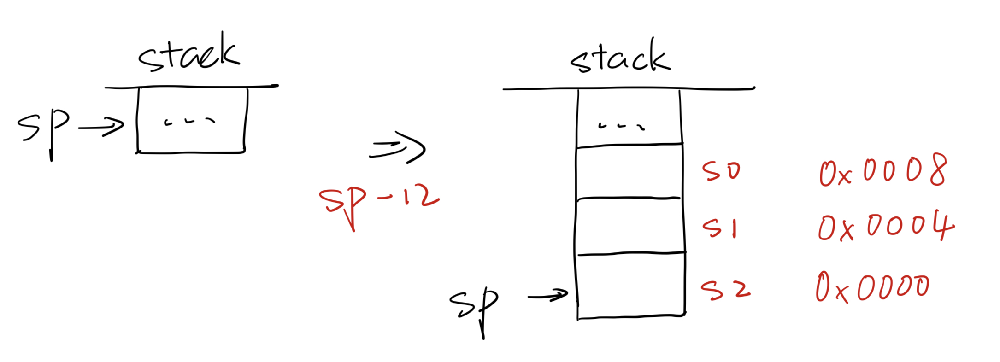

    ```assembly
    diffofsums:
    	addi $sp, $sp, -12	# make 12 bits space on stack to store 3 registers
    	# as s registers stores values in previous callee, we must store it in somewhere then assign our values in a new caller.
    	sw $s0, 8($sp)		# save $s0 on stack
    	sw $s1, 4($sp)		# save $s1 on stack
    	sw $s2, 0($sp)		# save $s2 on stack
    	
    	add $s2, $a0, $a1	# s2 = f + g
    	add $s1, $a2, $a3	# s1 = h + i
    	sub $s0, $s2, $s1   # result = (f+g) - (h+i)
    	add $v0, $s0, $0	# put return value in $v0
    	
    	# recover original s registers.
    	lw $s2, 0($sp)		# restore $s2 from stack
    	lw $s1, 4($sp)		# restore $s1 from stack
    	lw $s0, 8($sp)		# restore $s0 from stack
    	addi $sp, $sp, 12	# deallocate stack space
    	
    	jr $ra				# return to caller
    ```


-   MIPS registers are divided into two types: 

    

### System call

|     功能     | 调用号（`$v0`） |        参数         | 返回值（`$v0`） |
| :----------: | :-------------: | :-----------------: | :-------------: |
|   打印整数   |        1        |    `$a0`：整数值    |        -        |
|  打印字符串  |        4        |  `$a0`：字符串地址  |        -        |
|   读取整数   |        5        |          -          |  读取的整数值   |
| 动态内存分配 |        9        | `$a0`：请求的字节数 | 分配的内存地址  |
|   退出程序   |       10        |          -          |        -        |

```assembly
    .data 0x10010010 
msg: 
    .asciiz "Hello world!\n" 
    
    .text 
    .globl main 
main: 
    la $a0, msg     #load label msg 
    li $v0, 4       #load immediate 
    syscall         # print it 
    
    li $v0, 10 
    syscall         # exit 
```


## W5L1 Instruction Sets

>   ### Outline
>
>   -   ISA
>   -   R-type instructions
>   -   I-type instructions
>   -   J-type instructions


#### 1. Recap

-   RISC ISA: Reduced Instruction Set Computing
    -   As opposed to CISC (e.g. x86)
    -   Simple, elegant, easy to implement
-   **Instruction Set Architecture(ISA)**
    -   ==defines the set of operations that a computer can execute==
    -   ==the contract between the hardware and software==
    -   Examples
        -   x86: Intel
        -   ARM: Apple
        -   MIPS: Sony/Toshiba

#### 2. MIPS ISA

-   **All instructions and data are 32 bits**
-   32 32-bit registers
-   50 opcode : the first 6 bits
    -   Arithmetic / Logic operations
    -   Load / store operations
    -   Branch / jump operations
-   3 instruction formats
    -   R-type: all operands are registers
    -   I-type: one of the operands is an immediate value
    -   J-type: non-conditional, nonrelative branches


#### 3. R-format instructions


-   **Opcode:** partially specifies what instructions it is
    -   0 for all R-format instructions
-   **funct**: combined with opcode to specify the instruction
    -   e.g.: add: op(0), funct(32);	sub: op(0), funct(34)
-   **rs** (Source Register): used to specify register containing first operand
-   **rt** (S-next Register): used to specify register containing second operand
-   **rd** (Destination Register): used to specify register which will receive result of calculation
-   **shamt** (Shift amount): contains the amount a shift instruction will shift by

`add $rd, $rs, $rt`: the order is different.

#### 4. I-format instructions


-   **opcode**: **uniquely** specifies an I-format instruction
-   **rs**: specifies the **only** register operand
-   **rt**: specifies the register which receives the result of calculation (*target register*)
-   **immediate**: 16-bit **signed** integer, can represent up to $2^{16}$ different immediate values

Immediate constant for addi and addiu is signed. No need for **subi** or **subiu** instructions

Immediate constant for andi, ori, xori is unsigned

The limitation of I-instruction: the range of immediate number. If it surpasses the range, we have to use `lur` and `ori` to store a number into a 32-bit register and use R-instruction to replace it.

#### 5. J-format instructions


-   **opcode**: **uniquely** specifies an J-format instruction, so far, we've learnt `j` and `jal`
-   **JTA**: 26-bit jump target address, jump relative to the current PC value, jump in words not in bytes


## Digital Blocks and ALU Design

##### 1. Digital Building Blocks

-   Basic 


-   1-bit adders


-   Multi-bit adders


-   Subtractor

    -   `-B = B' + 1`

    -   `A - B = A + B' + 1 `

    -   Bit-wise inverse of B is B'


-   Comparator: Equality


-   Comparator: Less than
    -   Calculate A - B. If A < B, then result is negative
    -   for 2's complement numbers, (n-1)th bit is 1
    -   *N* 是二进制数的总位数，通常从 0 开始计数。因此，最高有效位是 (*N*−1)th 位，而不是 *N*th 位。


-   Multiplexer
    -   Selects between one of N inputs to connect to the output
    -   $\log_{2}{N}$-bit input selection: 需要多少位二进制数才能唯一表示 *N* 个不同的输入


-   Register
    -   store data in a circuit
    -   In **synchronous** circuits the output is **not** only controlled by the input but also by a **clock signal**
    -   use a clock signal to determine when to update the stored value
    -   edge-triggered: update when `Clk` changes from 0 to 1 or 1 to 0.


##### 2. ALU design


## W6L1 Single-Cycle CPU

>   ### Outline
>
>   -   Introducing the MIPS CPU design
>   -   Analyzing the instruction set
>   -   Constructing the datapath
>   -   Datapath with control unit


#### 1. Instruction execution process

1.   <u>PC</u>: instruction memory, fetch instruction
2.   <u>Register numbers</u>: register file, read registers
3.   <u>Depending on instruction types</u>
     -   Use ALU to calculate
         -   Arithmetic result
         -   Memory address for loading/storing
         -   Branch target address
     -   Access data memory for loading/storing
4.   <u>PC</u>: target address or PC + 4


#### 2. Logic Design Basics


#### 3. Sequential Elements

-   ==Register: stores data in a circuit==
    -   Uses a **clock signal** to determine when to update the stored value
    -   update when `Clk` changes from 0 to 1


-   ==Register with write control==
    -   Only updates on clock edge **when write control input is 1**
    -   Used when stored value is required later


#### 4. How to design a Processor

1.   Analyze the instruction set (datapath requirements)
     -   the meaning of each instruction is given by the *register transfers*
     -   datapath must include storage element
     -   datapath must support each register transfer
2.   Select the set of datapath components and establish clocking methodology
3.   Assemble datapath meeting the requirements
4.   Analyze the implementation of each instruction to determine the setting of control points that affect the register transfer
5.   Assemble the control logic


#### 5. Analyzing the Instruction Set

-   RTL (Register Transfer Language)
    -   gives the semantics of the instructions
    -   the chart is as follows
-   LOAD
    -   do sign extension with Imm16
    -   access Memory
-   BEQ
    -   || 00 means << 2 i.e. left shift by 2 bits
    -   imm16是CPU根据label的地址计算出来的


#### 6. What hardware are needed

-   Memory
    -   store instructions and data
-   Registers (32 * 32)
    -   read RS
    -   read RT
    -   Write RT or RD
-   PC
-   Extender for zero- or sign-extension
-   Calculating values in registers or extended immediate (ALU)
-   Add 4 or extended immediate to PC


#### 7. Sequential components for datapath:

1.   **Register**


-   Similar to the D Flip Flop except
    -   32-bit input and output
    -   Write Enable input
-   Write Enable
    -   Negated (0): **Data Out** will not change
    -   Asserted (1): **Data Out** will become **Data In**


2.   **Register file**


-   Consist of 32 registers
    -   two 32-bit output busses: **busA** and **busB**
    -   one 32-bit input bus: **busW**
-   Register is selected by:
    -   RA selects the register to put on busA
    -   RB selects the register to put on busB
    -   RW selects the register to be written via busW when Write Enable is 1
        -   e.g.: RW = 01010, this mean `$10 i.e. $t2` is going to be changed
-   Clock input (CLK)
    -   the CLK input is a factor ONLY during write operation
    -   during read, behaves as a combinational circuit


3.   Memory


-   One input bus: Data In
-   One output bus: Data Out
-   Word is selected by:
    -   **Address** selects the word to put on Data Out
    -   `Write Enable = 1`: address selects the memory word to be written via the Data In bus
-   Clock input (CLK)
    -   The CLK input is a factor during write and read operations


4.   Assembling the datapath


-   Instruction fetching is divided into two major steps
    -   Fetch the instruction: mem[PC]
    -   Update the program counter:
        -   Sequential code: `PC <- PC + 4`
        -   Branch and Jump: `PC <- "something else"`


-   **Arithmetic / logical operations**: `R[rd] <- R[rs] op R[rt] `
    -   e.g.: R-type instructions: add, sub, and, or, etc.
    -   RA, RB, RW, come from insttruction's `rs, rt, rd` fields, they are **index values**
    -   ALU and RegWrite: control logic after decoding


-   **load operations:** `lw rt, imm16(rs)` 
    -   `R[rt] <- MEM[R[rs] + sign_ext(imm16)]`

-   **store operations:** `sw rt, imm16(rs)`
    -   `MEM[R[rs] + sign_ext(imm16)] <- R[rt]`


- **Branch operations**: `beq rs, rt, imm16`

  ```
  mem[PC]
  Equal <- R[rs] == R[rt]
  if (Equal)
  	PC <- PC + 4 + (SignExt(Imm16)*4)
  else
  	PC <- PC + 4
  ```


-   A Single-Cycle Datapath


## W7L1 Instruction Pipelining

>   ### Outline
>
>   -   An overview of pipelining
>   -   A pipelined datapath
>   -   Pipelined control
>   -   Hazards: types of hazard
>       -   Handling data hazards
>       -   Handling branch hazards


#### 1. Pipelined datapath

-   IF: Instruction Fetch
-   ID: Instruction Decode
-   EX: Calculate the memory address
-   MEM: Read the data from the Data Memory
-   WB: Write the data back to the register file


#### 2. Pipeline hazards

-   Structural hazards
    -   Attempt to use the same resource in two different ways at the same time
-   Data hazards
    -   Attempt to use the data value before available
    -   Instruction depends on result of prior instruction still in the pipeline
-   Control hazards
    -   Attempt to make decision before condition is evaluated
    -   Most often happens in ==branch instruction==


#### 3. Data Hazards


-   Method 1: Insert NOP
    -   This really slows the CPU down!


-   Method 2: Forwarding (for R-type instruction)
    -   Hardware solution
    -   Feed the value directly to ALU read-in ports


-   Method 3: Stalling (for load instructions)
    -   Stall pipeline by "freezing" or duplicating the control/data values
    -   Namely: inserting a ==bubble== in the pipeline


